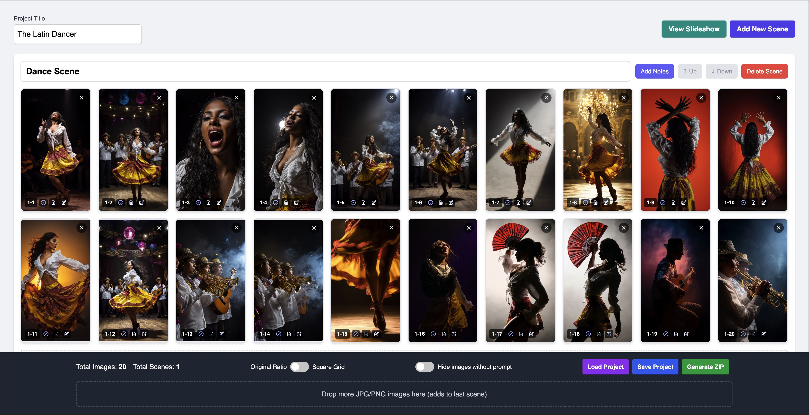

# AI Storyboard Image Sorter & Prompt Editor

## Purpose

This is a single-page web application designed to help creators organize sequences of reference images and their corresponding text prompts, primarily for storyboarding AI video generation projects. It allows users to upload images, visually sort them into the desired order, add prompts to each image, identify duplicates, and finally download the ordered images along with a manifest file containing the prompts.

## Features

- **Image Upload:**
  - Upload multiple images at once by clicking the initial instruction area or the dedicated drop zone in the footer.
  - Supports drag-and-drop of image files onto the page (initial area or footer drop zone).
  - Accepts only `.jpg`, `.jpeg`, and `.png` file types. Other file types are ignored (it can be configured by changing ACCEPTED_FILE_EXTENSIONS).
- **Grid Display & Sorting:**
  - Uploaded images are displayed in a responsive grid.
  - Images can be easily reordered using drag-and-drop.
- **Prompt Management:**
  - Add, edit, or delete text prompts for each image via a modal window.
  - Click the pencil icon (📝) on an image overlay to open the prompt editor.
  - Images with existing prompts have a visual indicator (brighter icon color).
- **Duplicate Detection:**
  - Automatically detects duplicate images based on filename, size, and modification date.
  - Marks all instances of a duplicate image with a "Duplicated" tag.
  - Highlights the index number (yellow background, red text) of all duplicated images.
- **Filtering & Display Options:**
  - **Hide Images Without Prompt:** A toggle in the footer allows hiding images that do not yet have a prompt associated with them, helping to focus on annotated items.
  - **Aspect Ratio Toggle:** Switch between viewing images in their original aspect ratio or forcing them into a square grid layout.
- **ZIP Export:**
  - **Generate ZIP:** Creates a ZIP archive containing all uploaded images.
    - Images are renamed according to their current order in the grid (e.g., `001.jpg`, `002.png`, ...), padded with leading zeros up to 3 digits for consistent sorting.
    - Includes a `manifest.json` file within the ZIP. This file lists all image filenames in order and their corresponding prompts.
  - **Download Link:** After generation, a "Download ZIP" link appears, allowing the user to save the archive. The link is cleared if the image sequence is modified.

## How to Use

2.  **Open:** Open index.html file in your web browser. Running it locally is recommended for full functionality (especially downloads). You may also serve the file locally by spinning up a local web server (i.e.: `python3 -m http.server`)
3.  **Upload Images:**
    - Click the main instruction area or the "Drop more..." area in the footer to open a file selection dialog.
    - Alternatively, drag and drop `.jpg` or `.png` files onto the page (instruction area or footer drop zone).
4.  **Add Prompts:** Click the pencil icon (📝) on any image to open the modal and add/edit its prompt. Click "Save Prompt".
5.  **Sort Images:** Drag and drop images within the grid to arrange them in the desired sequence.
6.  **Filter (Optional):** Use the "Hide images without prompt" toggle in the footer to focus on images with prompts. Use the "Aspect Ratio" toggle to change the view.
7.  **Generate & Download:**
    - Click the "Generate ZIP" button in the footer. This prepares the ZIP file and the `manifest.json`.
    - Once generation is complete, a "Download ZIP" link will appear next to the button.
    - Click the "Download ZIP" link to save the archive containing the ordered, renamed images and the manifest file.
    - If you modify the images (add, remove, reorder, edit prompt) after generating, you will need to click "Generate ZIP" again to get an updated archive.

## Technical Notes

- This is a client-side application; all processing happens within your browser. No data is uploaded to any server.
- It relies on JavaScript libraries (included via CDN):
  - **SortableJS:** For drag-and-drop sorting.
  - **JSZip:** For creating the ZIP archive in the browser.
  - **Tailwind CSS:** For styling (via CDN script).
- Uses `URL.createObjectURL()` for efficient image preview display to minimize memory usage compared to `dataURL`. Object URLs are revoked automatically during use and on page unload to prevent memory leaks.
- Uses event delegation for handling clicks on remove/prompt buttons for better performance with many images.

## Limitations

- Being purely client-side, the state (uploaded images, order, prompts) is lost when the browser tab is closed unless the "Save/Load Session" feature is implemented.
- Performance might degrade with an extremely large number of very high-resolution images due to browser limitations, although optimizations are in place.
- Download functionality relies on standard browser mechanisms and might be affected by strict security settings (though running locally usually avoids this).
